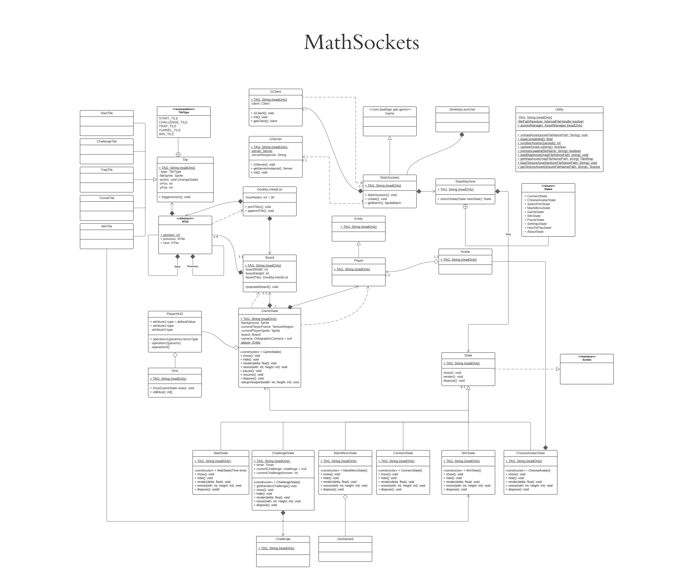
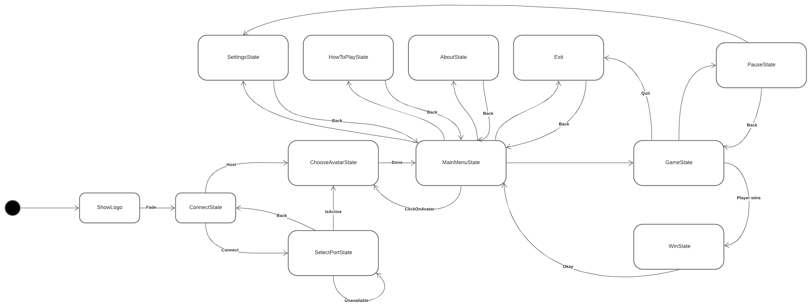

 
# MathSockets 
 
- Doc [link](https://www.overleaf.com/9279542132rnkkgsrbsxyq) to OverLeaf
- Repo [link](https://github.com/Vivallo04/MathSockets) to GitHub
- Class Diagram [link](https://lucid.app/lucidchart/invitations/accept/inv_ecb42170-a261-42f3-b955-15b89e92216e?viewport_loc=-1707%2C-1590%2C5913%2C3003%2C0_0) to LucidChart
---
## Current Architecture of the Program

---
## Workflow of the Game (State Machine)

---
## Pending
- Client-Server connection
- Game Board
- Main UI
- Main Menu
- Documentation
- Game Challenges
- JUnit tests
- Find Entity Sprites
- Player connection
- Parse JSON files
